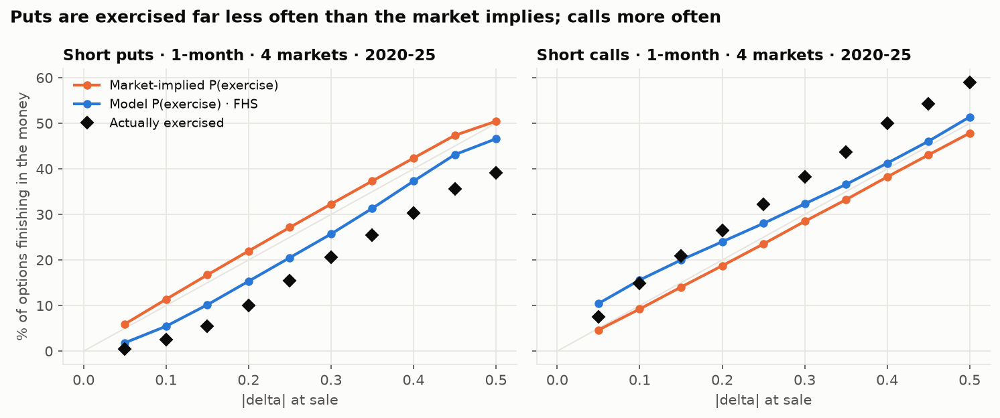
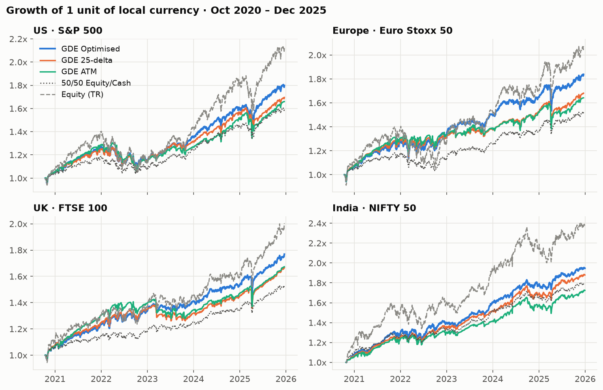
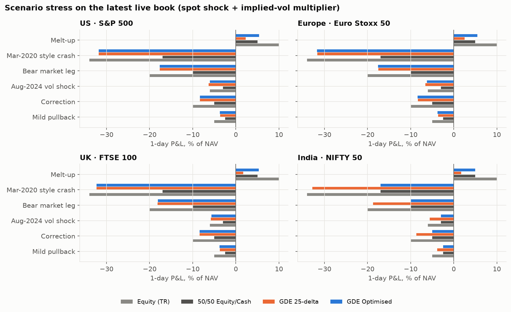
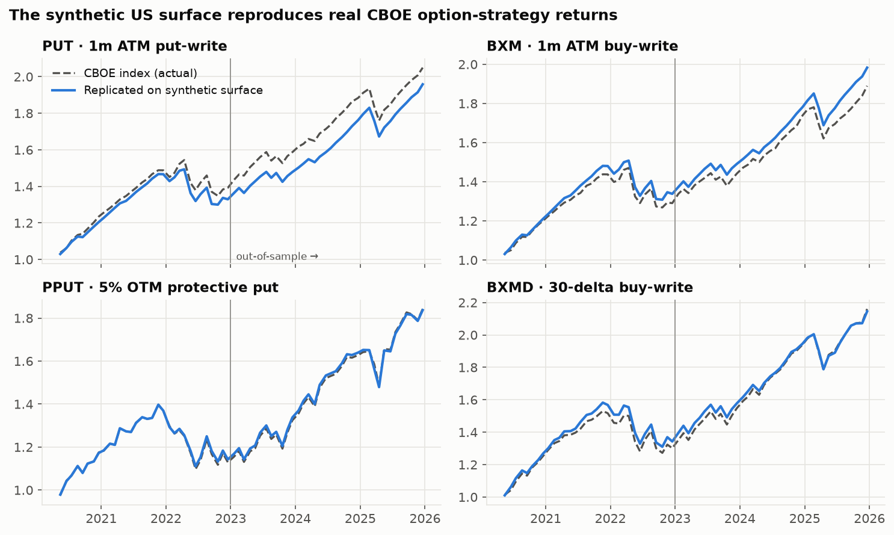

# Option Selling Strategy Optimiser: Picking Strikes Least Likely to Be Exercised

**Put & covered-call writing backtested on US, European, UK and Indian indices (2020–2025).**

Parametric's *Global Defensive Equity* strategy harvests the **volatility risk premium (VRP)** by
underwriting cash-collateralised index puts and overwriting calls on an equity sleeve. This project
asks the question at the heart of that business:

> *Which options can we sell that will almost never be exercised, and are they still worth selling?*

No one can know in advance that an option won't be exercised. What can be measured is
**how much more often the market *expects* exercise than it actually happens**. Implied volatility
carries a risk premium, so market-implied exercise probabilities are systematically too high. This
engine estimates the *real-world* probability, compares it with the market's, and sells the strikes
where premium most exceeds expected payout after tail risk.

## Key findings

**1. The market systematically overprices put exercise.** Across ~100k one-month options in four
markets, puts sold at a given delta finished in the money far less often than their price implied:

| Put sold at | Market-implied P(exercise) | Actually exercised | Avg. premium kept (% of spot / month) |
|---|---:|---:|---:|
| 10-delta | 11.4% | **2.5%** | +0.29% |
| 25-delta | 27.2% | **15.5%** | +0.56% |
| 50-delta (ATM) | 50.5% | **39.1%** | +0.66% |



**2. Calls are the opposite, and the model knew it ahead of time.** Calls finished in the money *more* often than
implied (32% vs 23.5% at 25-delta), and the realised edge was negative at every call delta. Call-wing
implied vol sits *below* forecast volatility, so the optimiser declined almost every call overwrite before the
fact. That decision holds even when the equity-risk-premium assumption is set to zero.

**3. A structural model beats both the market and ML at predicting exercise.** Scored walk-forward
2021–25 (Brier, lower is better): FHS model **0.170** vs market-implied 0.175 vs ML layer 0.183. The ML
layer (and a gradient-boosted classifier before it) overfit to regime shifts. Five years of overlapping
monthly outcomes is ~70 independent expiries per market, which is too few to learn from.

**4. GDE Optimised has the best risk-adjusted return in all four markets:**

| Market | Strategy | CAGR | Vol | Sharpe | Max DD | Puts exercised |
|---|---|---:|---:|---:|---:|---:|
| US | 50/50 equity/cash | 9.5% | 8.4% | 0.76 | -12.2% | — |
| | GDE 25-delta (fixed) | 10.7% | 10.4% | 0.74 | -15.5% | 16% |
| | **GDE Optimised** | **12.0%** | 10.2% | **0.87** | **-13.5%** | **7%** |
| Europe* | 50/50 equity/cash | 8.5% | 8.6% | 0.80 | -12.6% | — |
| | GDE 25-delta (fixed) | 10.6% | 10.4% | 0.87 | -13.0% | 13% |
| | **GDE Optimised** | **12.5%** | 10.6% | **1.01** | **-12.4%** | **8%** |
| UK* | 50/50 equity/cash | 8.7% | 6.5% | 0.87 | -6.4% | — |
| | GDE 25-delta (fixed) | 10.4% | 7.6% | 0.96 | -9.8% | 15% |
| | **GDE Optimised** | **11.7%** | 7.6% | **1.11** | **-9.4%** | **4%** |
| India | 50/50 equity/cash | 11.9% | 7.0% | 0.90 | -7.5% | — |
| | GDE 25-delta (fixed) | 13.0% | 7.8% | 0.94 | -8.2% | 19% |
| | **GDE Optimised** | **13.8%** | 8.0% | **1.01** | -8.6% | **9%** |

<sub>Oct 2020 – Dec 2025, local currency, costs included. Sharpe is measured against the local cash rate. *Synthetic surfaces, indicative.</sub>



**5. Honest attribution: most of the gain comes from the call decision, not put strike selection.**
Holding everything else fixed, dropping calls lifts Sharpe in every market. Optimising the put strike
on its own roughly halves the exercise rate and reduces drawdowns in the US and UK, but its Sharpe
effect is mixed (better in US/UK, slightly worse in Europe/India). Across a risk-aversion sweep
λ ∈ {0, 0.01, 0.02, 0.05, 0.10}, GDE Optimised keeps a higher Sharpe than fixed 25-delta in 17 of 20
market/λ combinations. The three misses are all in India.

**6. Strike selection doesn't protect you in a crash; position sizing does.** In a
March-2020-style shock (-34%, vol ×3), every put-writing book loses ~32% of NAV whatever strike it
chose, because the collateralised puts go deep in the money. The premium is the only cushion, and tail risk is
set by the equity/collateral split. This is why the strategy is sized the way GDE is.



**7. The tool also says when *not* to sell.** On 31 Dec 2025 it recommends a Feb-2026 15-delta S&P
put (model P(exercise) 8% vs market 17%), only a marginal 5-delta FTSE put, and **nothing at all
on NIFTY**. India implied vol was ~9–11%, near its lows, and the model's exercise probability was
about equal to the market's, so there was no premium left to harvest.

Full tables (per-market metrics, crisis episodes, calibration, sensitivity, attribution, stress and
live strike scans) are in **[`reports/results.md`](reports/results.md)**.



## How it works

```
 Free data                    Models                              Decisions & evaluation
 ─────────                    ──────                              ──────────────────────
 NSE bhavcopy (real NIFTY  ┐  Option surface ─┬─ Market P(exercise)  ┐
   option chains)          │  (real / synth.) │   = N(-d2) at IV     │
 Yahoo: indices, VIX term  ├─►                │                      ├─► Strike optimiser ──► GDE backtest
   structure, India VIX    │  HAR-RV + GJR-   ├─ Physical P(exercise)│   max (edge - λ·CVaR)    (5 strategies × 4 markets)
 FRED: T-bill, €STR, SONIA │  GARCH forecast ─┤   via Filtered Hist. │   s.t. P(ex) ≤ cap              │
 RBI repo schedule         │                  │   Simulation         │                                 ▼
 CBOE PUT/BXM/PPUT/BXMD ───┴─► calibrates     └─ ML layer (walk-fwd) ┘                     Risk: Greeks, stress,
   (real benchmark returns)    the synthetic surface                                        episodes, λ-sensitivity
```

| # | Module | What it does | Code |
|---|---|---|---|
| 1 | **Data layer** | Downloads and normalises every free source; caches per day | `data/nse.py`, `data/market.py` |
| 2 | **Option surface** | One interface over real NSE chains (India) and a calibrated synthetic surface (US/EU/UK) | `pricing/surface.py`, `pricing/bs.py` |
| 3 | **VRP monitor** | Implied vs forecast vs realised vol; ex-ante and ex-post premium | `analytics/vrp.py` |
| 4 | **Exercise-probability model** | Market-implied vs FHS physical vs ML probabilities, scored walk-forward | `models/volforecast.py`, `models/probability.py` |
| 5 | **Strike optimiser** | Picks the strike with the best tail-adjusted edge, or declines to sell | `optimizer/strikes.py` |
| 6 | **GDE backtester** | Equity + covered calls + cash-secured puts, daily mark-to-market, costs | `backtest/engine.py` |
| 7 | **Risk & stress** | Sharpe/Sortino/alpha/capture, Greeks, scenario stress, crisis episodes | `risk/metrics.py`, `risk/stress.py` |
| + | **Dashboard & report** | Streamlit app with a live strike scanner; static figures + tables | `dashboard/app.py`, `report.py` |

### Data: real where free, calibrated where not

| Market | Underlying | Option prices | Vol input | Short rate |
|---|---|---|---|---|
| India | NIFTY 50 | **Real** NSE daily settlement prices, all strikes (2.7M rows) | chain IVs (0.99 corr. with India VIX) | RBI repo |
| US | S&P 500 | Synthetic, **calibrated to real CBOE benchmark returns** | VIX9D / VIX / VIX3M | 3m T-bill |
| Europe | Euro Stoxx 50 | Synthetic (US surface × trailing RV ratio) | VIX, scaled | €STR |
| UK | FTSE 100 | Synthetic (US surface × trailing RV ratio) | VIX, scaled | SONIA |

Historical option chains cost money everywhere except India. For the US, the surface is built from
the VIX term structure plus a two-wing smile. Its three parameters are fitted so that replaying the
CBOE **PUT**, **BXM**, **PPUT** and **BXMD** indices on the synthetic surface reproduces their actual
published returns. It is fitted on 2020–22 and tested out of sample on 2023–25. EU/UK volatility indices
(VSTOXX, FTSE IVI) have no free history, so their surfaces are the US surface scaled by each market's
trailing realised-vol ratio. **EU and UK results are therefore the least reliable of the four** and
should be read as indicative.

### Design decisions worth defending

* **No look-ahead anywhere.** Volatility models refit on expanding windows; FHS only uses return
  paths that had *completed* by the decision date; the ML layer trains only on options whose expiry
  preceded the test year; EU/UK use the *previous* US session's VIX (the US closes after them).
* **Strictly post-COVID data.** Nothing before 15 Apr 2020 is loaded. The first ~6 months are model
  burn-in, so all strategies are compared from Oct 2020. Because the window *excludes* the March 2020
  crash, the physical return distribution is **shrunk toward a fat-tailed Student-t prior**, and a
  "Mar-2020 style" (-34%, vol ×3) scenario is included in the stress tests.
* **Conservative physical drift.** The real-world model assumes a 3% equity risk premium, not the
  ~15%/yr the indices actually delivered, so strike choices are not flattered by hindsight.
* **Risk aversion set before seeing results** (λ = 0.02), with a sensitivity table across
  λ ∈ {0, 0.01, 0.02, 0.05, 0.10}.
* **Negative results are reported.** A gradient-boosted classifier and a logistic layer were both
  tested against the structural FHS model; neither beat it out of sample (details below).

## Run it

```bash
uv sync                                   # Python 3.12, deps in pyproject.toml
uv run python -m vrp_alpha.pipeline       # downloads free data (NSE ~10 min first time), runs everything
uv run python -m vrp_alpha.report         # figures -> reports/figures, tables -> reports/results.md
uv run streamlit run dashboard/app.py     # interactive dashboard with live strike scanner
uv run pytest                             # unit + integration tests
```

Parameters (window, portfolio weights, costs, optimiser grid, λ, stress scenarios) are in `config.yaml`.

## Limitations

* **Synthetic surfaces for US/EU/UK.** The US surface is validated against real benchmark returns;
  EU and UK inherit US smile shape and VRP level, so their numbers are indicative only.
* **End-of-day marks, hold-to-expiry.** No intraday execution, early rolls or delta hedging. Costs
  are a premium haircut (3% or a minimum in index points), not a full spread model. US options are
  settled at the close rather than the AM SOQ.
* **Five years, one mostly-bullish regime.** ~62 monthly cycles per market is a short sample for a
  strategy whose risk sits in rare crashes. The stress tests address this, but the backtest cannot.
* **Constant dividend yields** per index; RBI repo used as the INR cash rate (T-bills trade near repo).
